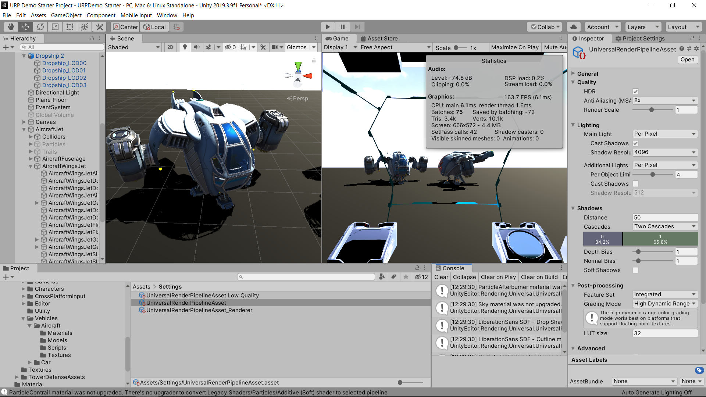

# Universal Rendering Pipeline (URP)

El Universal Rendering Pipeline (URP) muestra la optimizacion del rendimiento de iluminación en tiempo real.en base a la compensaciones de sombras y renderizados por medio del package Universal RP.

            
    </a>

## Version recomendada:

- Unity 2019.3 o superior

## Requisitos:

- Window/Package Manage/Universal RP

- Edit> Render Pipeline> Universal Render Pipeline> Upgrate Project Material to UniversalRP Material

